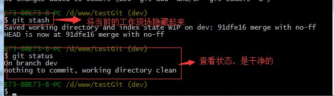
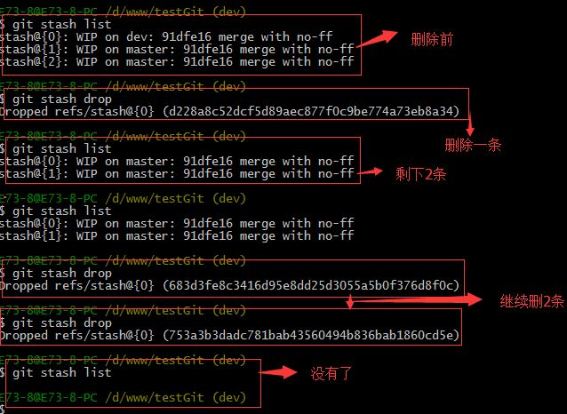

# Git 使用指南（标准版）

## 说明

学习和理解 [Git使用教程,最详细，最傻瓜，最浅显，真正手把手教](https://zhuanlan.zhihu.com/p/30044692)

相当于过了一遍

[Git 分支在线练习](https://learngitbranching.js.org/?NODEMO)

## 介绍

### Git 是什么

Git 是分布式版本控制系统

工作原理/流程如下图所示


1. Workspace：工作区
2. Index / Stage：暂存区
3. Repository：仓库区（或本地仓库）
4. Remote：远程仓库

### SVN 与 Git 的最主要的区别

``` bash
SVN 是集中式版本控制系统，版本库是集中放在中央服务器的，而干活的时候，用的都是自己的电脑，所以首先要从中央服务器哪里得到最新的版本，然后干活，干完后，需要把自己做完的活推送到中央服务器。集中式版本控制系统是必须联网才能工作，如果在局域网还可以，带宽够大，速度够快，如果在互联网下，如果网速慢的话，就纳闷了。

Git 是分布式版本控制系统，那么它就没有中央服务器的，每个人的电脑就是一个完整的版本库，这样，工作的时候就不需要联网了，因为版本都是在自己的电脑上。既然每个人的电脑都有一个完整的版本库，那多个人如何协作呢？比如说自己在电脑上改了文件A，其他人也在电脑上改了文件A，这时，你们两之间只需把各自的修改推送给对方，就可以互相看到对方的修改了。
```

## 安装 Git

### 在 Windows 上安装 Git

&nbsp;&nbsp;&nbsp;&nbsp;[Git 下载](https://git-scm.com/downloads)

(PS: 可能需要科学上网)

在开始菜单里找到 `Git` -> `Git Bash`，名称和邮箱是 Github 上的

``` bash
# 指定 Github 的用户名
git config -- global user.name "username"

# 指定 Github 的邮箱
git config -- global user.email "xxxxxxxx@gmail.com"
```

因为Git是分布式版本控制系统，所以需要填写用户名和邮箱作为一个标识。

注意：`git config --global` 参数，有了这个参数，表示你这台机器上所有的 Git 仓库都会使用这个配置，当然你也可以对某个仓库指定的不同的用户名和邮箱。

### 在 Centos 下安装 Git

``` bash
sudo yum install git
```

## 操作

### 创建版本库

``` bash
    版本库又名仓库，英文名 repository ,你可以简单的理解一个目录，这个目录里面的所有文件都可以被 Git 管理起来，每个文件的修改，删除，Git都能跟踪，以便任何时刻都可以追踪历史，或者在将来某个时刻还可以将文件”还原”。
```

新建一个文件夹 `test` ,在命令行下进入该目录对其进行初始化操作

``` bash
# 将当前目录变成 git 可以管理的仓库
    git init
```
### 添加文件到版本库
&nbsp;&nbsp;&nbsp;&nbsp;在仓库中新建一个文件 `readme.md`，添加相应的内容，然后进行如下操作

``` bash
# 1. 将 readme.md 添加到暂存区
git add readme.md

# 2. 将暂存区的内容提交到本地仓库， xxx 是提交的注释
git commit -m "xxx"

# 3. 查看是否有文件未提交
git status

# 4. 修改 readme.md 文件内容，通过'git status'可以得到文件已经修改过
# 通过以下命令查看修改内容

git diff readme.md

# 5. 修改过后重复 1、2 步骤

# 6. 第一次提交到远程
```

### 版本回退

&nbsp;&nbsp;&nbsp;&nbsp;为 readme.md 添加一行内容然后添加到本地仓库

&nbsp;&nbsp;&nbsp;&nbsp;查看历史提交记录
``` bash
# 1. 查看历史
git log

# 2. 单行显示提交历史注释
git log –pretty=oneline
```

&nbsp;&nbsp;&nbsp;&nbsp;版本回退
``` bash
# 1. 回退到上一个版本
git reset --hard HEAD^

# 2. 回退到上2个版本
git reset --hard HEAD^^

# 3. 回退到上100个版本
git reset --hard HEAD~100
```

&nbsp;&nbsp;&nbsp;&nbsp;回退到之前的版本之后又想恢复到最新的版本
``` bash
# 1. 获取版本号
git reflog

# 2. 恢复指定版本的数据，6fcfc89 为要恢复版本的版本号
git reset --hard 6fcfc89
```

### 工作区与暂存区的区别

&nbsp;&nbsp;&nbsp;&nbsp;区别
``` bash
    在电脑上看到的目录，比如目录下test里的文件(.git隐藏目录版本库除外)。或者以后需要再新建的目录文件等等都属于工作区范畴。

    版本库(Repository)：工作区有一个隐藏目录.git,这个不属于工作区，这是版本库。其中版本库里面存了很多东西，其中最重要的就是 stage(暂存区)，还有Git为我们自动创建了第一个分支 master ,以及指向 master 的一个指针HEAD。
```

使用Git提交文件到版本库有两步：

1. 是使用 `git add` 把文件添加进去，实际上就是把文件添加到暂存区。

2. 使用 `git commit` 提交更改，实际上就是把暂存区的所有内容提交到当前分支上。

&nbsp;&nbsp;&nbsp;&nbsp;在多次添加文件之后可以通过 `git commit` 一次性提交

### 撤销修改和删除文件

&nbsp;&nbsp;&nbsp;&nbsp;撤销修改

对文件进行修改之后不满意想回到原来的版本(但记不清该删什么，又想不通过版本回退)

``` bash
# 1. 丢弃工作区的修改,如果加入到暂存区就不能撤销修改了
git checkout -- readme.md
```

(PS: 命令 `git checkout -- readme.md` 中的 `--` 很重要，如果没有 `--` 的话，那么命令变成创建分支了)

&nbsp;&nbsp;&nbsp;&nbsp;删除文件
``` bash
# 1. 在工作区删除文件
# 之后有两个选择(1. commit 2. 从版本库中恢复被删掉的文件)
rm readme.md

# 2. 未 commit 之前 从版本库中恢复被删掉的文件
git checkout -- readme.md
```

### 远程仓库

#### 配置 GitHub

&nbsp;&nbsp;&nbsp;&nbsp;登陆注册 GitHub [https://github.com/](https://github.com/)

&nbsp;&nbsp;&nbsp;&nbsp;本地 Git仓库 和 GitHub仓库 之间的传输是通过 SSH 加密的，所以需要如下操作

``` bash
# 1. 创建 SSH Key
# 在用户主目录下，看看有没有.ssh目录，如果有，再看看这个目录下有没有
# id_rsa和id_rsa.pub这两个文件，如果有的话，直接跳过此如下命令，
# 如果没有的话，打开命令行，输入如下命令
ssh-keygen -t rsa -C "Github的注册邮箱地址"

# 2.
# 登录 GitHub,打开 "Settings" 中的 SSH Keys 页面
# 然后点击 "Add SSH Key" ,填上任意 title
# 在 Key 文本框里粘贴 id_rsa.pub 文件的内容。
```

(PS: id_rsa 是私钥，不能泄露出去，id_rsa.pub 是公钥，可以放心地告诉任何人)

#### 添加远程仓库

&nbsp;&nbsp;&nbsp;&nbsp;现在的情景是：我们已经在本地创建了一个 Git仓库 后，又想在 GitHub 创建一个 Git仓库，并且希望这两个仓库进行远程同步，这样 GitHub 的仓库可以作为备份，又可以其他人通过该仓库来协作

&nbsp;&nbsp;&nbsp;&nbsp;
``` bash
# 1. New repository

# 2. 输入 Repository name (与本地仓库同名)
testgit
# 3. Create repository

# 4. 将一个已有的本地仓库与远程仓库关联
git remote add origin https://github.com/username/testgit.git

# 5. 将本地仓库 master 分支的内容推送到远程仓库中
git pish -u origin master

# 6. 第二次及之后上传项目
git push origin master

# 说明  由于远程库是空的，我们第一次推送 master 分支时，加上了 –u 参数
# Git 不但会把本地的 master 分支内容推送的远程新的 master 分支
# 还会把本地的 master 分支和远程的 master 分支关联起来
```

#### 从远程仓库克隆项目到本地

``` bash
git clone https://github.com/username/testgit
```

### 创建与合并分支

#### 分支说明

每次提交，Git 都把它们串成一条时间线，这条时间线就是一个分支。截止到目前，只有一条时间线，在 Git 里，这个分支叫主分支，即 master 分支。HEAD 严格来说不是指向提交，而是指向 master ，master 才是指向提交的，所以，HEAD 指向的就是当前分支。

#### Demo

创建 dev 分支，并切换到该分支

``` bash
# 1. 创建 dev 分支并切换分支
    git checkout -b dev

# 2. 查看当前的分支，列出所有的分支，当前分支前面会添加一个星号
    git branch
```


git checkout 命令加上 –b参数表示创建并切换，相当于如下2条命令

``` bash
# 创建分支
    git branch dev

# 切换分支
    git checkout dev
```

新建一个文件 `test_branch_dev.txt` ，在里面添加一些内容，然后做以下操作，验证切换分支之后前一个分支的操作能否被查看


#### 合并分支

``` bash 
# 在 master 分支上合并 dev 分支的内容
    git merge dev

# 继续查看 test_branch_dev.txt 的内容
    cat test_branch_dev.txt
```


注意到上面的 Fast-forward 信息，Git 告诉我们，这次合并是“快进模式”，也就是直接把 master 指向 dev 的当前提交，所以合并速度非常快。

#### 删除分支

``` bash
# 删除 dev 分支
    git branch -d dev

# 查看分支命令
    git branch
```


#### 分支操作命令合集

``` bash
# 查看分支
    git branch

# 创建分支
    git branch name

# 切换分支
    git checkout name

# 创建+切换分支
    git checkout –b name

# 合并某分支到当前分支
    git merge name

# 删除分支
    git branch –d name
```

#### 分支冲突

``` bash
# 新建并切换分支
    git checkout –b fenzhi1

# 查看 test_branch_dev.txt 的内容
    cat test_branch_dev.txt

# 添加内容后继续查看 test_branch_dev.txt 的内容
    cat test_branch_dev.txt

# 添加到暂存区
    git add test_branch_dev.txt

# 提交到本地仓库
    git commit -m "add fenzhi1"

```


``` bash
# 切换到 master 分支
    git checkout master

# 查看 test_branch_dev.txt 的内容
    cat test_branch_dev.txt

# 添加内容后继续查看 test_branch_dev.txt 的内容
    cat test_branch_dev.txt

# 添加到暂存区
    git add test_branch_dev.txt

# 提交到本地仓库
    git commit -m "add master"
```


``` bash
# 在 master 分支上合并 branch1
    git merge fenzhi1

# 查看状态
    git status

# 查看 test_branch_dev.txt 的内容
    cat test_branch_dev.txt
```


Git用<<<<<<<，=======，>>>>>>>标记出不同分支的内容，其中<<<HEAD是指主分支修改的内容，>>>>>fenzhi1 是指fenzhi1上修改的内容

``` bash
# 解决分支冲突，将文件test_branch_dev.txt的内容修改成主干代码的
# 查看 test_branch_dev.txt 的内容
    cat test_branch_dev.txt
```


``` bash
# 查看分支合并的情况
    git log
```


#### 分支管理策略

通常合并分支时，git 一般使用 `Fast forward` 模式，在这种模式下，删除分支后，会丢掉分支信息，现在我们来使用带参数 `–no-ff` 来禁用 `Fast forward` 模式

演示如下


分支策略：首先 master主分支 应该是非常稳定的，也就是用来发布新版本，一般情况下不允许在上面干活，干活一般情况下在新建的 dev分支 上干活，干完后，比如上要发布，或者说 dev分支 代码稳定后可以合并到 主分支master 上来。

### Bug 分支

在开发中，会经常碰到bug问题，那么有了bug就需要修复，在Git中，分支是很强大的，每个bug都可以通过一个临时分支来修复，修复完成后，合并分支，然后将临时的分支删除掉。

比如我在开发中接到一个404 bug时候，我们可以创建一个404分支来修复它，但是，当前的dev分支上的工作还没有提交。比如如下：


并不是我不想提交，而是工作进行到一半时候，我们还无法提交，比如我这个分支bug要2天完成，但是我issue-404 bug需要5个小时内完成。怎么办呢？还好，Git还提供了一个stash功能，可以把当前工作现场 ”隐藏起来”，等以后恢复现场后继续工作。如下：



所以现在我可以通过创建issue-404分支来修复bug了。

首先我们要确定在那个分支上修复bug，比如我现在是在主分支master上来修复的，现在我要在master分支上创建一个临时分支，演示如下：


现在，我们回到dev分支上干活了


工作区是干净的，那么我们工作现场去哪里呢？我们可以使用命令 git stash list来查看下。如下：


工作现场还在，Git把stash内容存在某个地方了，但是需要恢复一下，可以使用如下2个方法：

1.git stash apply恢复，恢复后，stash内容并不删除，你需要使用命令git stash drop来删除。

2.另一种方式是使用git stash pop,恢复的同时把stash内容也删除了。
演示如下



### 多人协作

当你从远程库克隆时候，实际上Git自动把本地的master分支和远程的master分支对应起来了，并且远程库的默认名称是origin。

要查看远程库的信息 使用 git remote
要查看远程库的详细信息 使用 git remote –v
如下演示：


#### 推送分支

推送分支就是把该分支上所有本地提交到远程库中，推送时，要指定本地分支，这样，Git就会把该分支推送到远程库对应的远程分支上

``` bash
# 推送到 master分支
    git push origin master
```

``` bash
# 推送到 dev分支
    git push origin dev
```

那么一般情况下，那些分支要推送呢？

master分支 是主分支，因此要时刻与远程同步。

一些 修复bug分支 不需要推送到远程去，可以先合并到主分支上，然后把主分支master推送到远程去。

#### 抓取分支

多人协作时，大家都会往 master分支 上推送各自的修改。现在我们可以模拟另外一个同事，可以在另一台电脑上（注意要把SSH key添加到github上）或者同一台电脑上另外一个目录克隆，新建一个目录名字叫testgit2

但是我首先要把dev分支也要推送到远程去，如下


接着进入testgit2目录，进行克隆远程的库到本地来，如下


现在目录下生成有如下所示


现在我们的小伙伴要在 dev分支 上做开发，就必须把远程的origin的 dev分支 到本地来，于是可以使用命令创建本地dev分支：`git checkout –b dev origin/dev`

现在小伙伴们就可以在 dev分支 上做开发了，开发完成后把 dev分支 推送到远程库时。

如下


小伙伴们已经向origin/dev分支上推送了提交，而我在我的目录文件下也对同样的文件同个地方作了修改，也试图推送到远程库时，如下


由上面可知：推送失败，因为我的小伙伴最新提交的和我试图推送的有冲突，解决的办法也很简单，上面已经提示我们，先用git pull把最新的提交从origin/dev抓下来，然后在本地合并，解决冲突，再推送。


git pull 也失败了，原因是没有指定 本地dev分支 与 远程origin/dev分支 的链接，根据提示，设置dev和origin/dev的链接：如下


这回git pull成功，但是合并有冲突，需要手动解决，解决的方法和分支管理中的 解决冲突完全一样。解决后，提交，再push：

我们可以先来看看readme.txt内容了


现在手动已经解决完了，我接在需要再提交，再push到远程库里面去。如下所示


因此：多人协作工作模式一般是这样的：

首先，可以试图用 `git push origin branch-name` 推送自己的修改.

如果推送失败，则因为远程分支比你的本地更新早，需要先用 `git pull` 试图合并。

如果合并有冲突，则需要解决冲突，并在本地提交。再用 `git push origin branch-name` 推送。


## 阮老师整理的部分命令

[阮老师整理的部分命令](http://www.ruanyifeng.com/blog/2015/12/git-cheat-sheet.html)

### 新建代码库

``` bash
# 在当前目录新建一个Git代码库
$ git init

# 新建一个目录，将其初始化为Git代码库
$ git init [project-name] 

# 下载一个项目和它的整个代码历史
$ git clone [url]
```

### 配置

Git 的设置文件为 `.gitconfig` ，它可以在用户主目录下（全局配置），也可以在项目目录下（项目配置）

``` bash
# 显示当前的Git配置
$ git config --list

# 编辑Git配置文件
$ git config -e [--global] 

# 设置提交代码时的用户信息
$ git config [--global] user.name "[name]"
$ git config [--global] user.email "[email address]"
```

### 增加/删除文件

``` bash
# 添加指定文件到暂存区
$ git add [file1] [file2] ... 

# 添加指定目录到暂存区，包括子目录
$ git add [dir] 

# 添加当前目录的所有文件到暂存区
$ git add . 

# 添加每个变化前，都会要求确认 
# 对于同一个文件的多处变化，可以实现分次提交
$ git add -p

# 删除工作区文件，并且将这次删除放入暂存区
$ git rm [file1] [file2] ... 

# 停止追踪指定文件，但该文件会保留在工作区
$ git rm --cached [file] 

# 改名文件，并且将这个改名放入暂存区
$ git mv [file-original] [file-renamed]
```

### 代码提交
``` bash
# 提交暂存区到仓库区
$ git commit -m [message] 

# 提交暂存区的指定文件到仓库区
$ git commit [file1] [file2] ... -m [message] 

# 提交工作区自上次commit之后的变化，直接到仓库区
$ git commit -a

# 提交时显示所有diff信息
$ git commit -v

# 使用一次新的commit，替代上一次提交 
# 如果代码没有任何新变化，则用来改写上一次commit的提交信息
$ git commit --amend -m [message] 

# 重做上一次commit，并包括指定文件的新变化
$ git commit --amend [file1] [file2] ...
```

### 分支

``` bash
# 列出所有本地分支
$ git branch

# 列出所有远程分支
$ git branch -r

# 列出所有本地分支和远程分支
$ git branch -a

# 新建一个分支，但依然停留在当前分支
$ git branch [branch-name] 

# 新建一个分支，并切换到该分支
$ git checkout -b [branch] 

# 新建一个分支，指向指定commit
$ git branch [branch] [commit] 

# 新建一个分支，与指定的远程分支建立追踪关系
$ git branch --track [branch] [remote-branch] 

# 切换到指定分支，并更新工作区
$ git checkout [branch-name] 

# 切换到上一个分支
$ git checkout - 

# 建立追踪关系，在现有分支与指定的远程分支之间
$ git branch --set-upstream [branch] [remote-branch] 

# 合并指定分支到当前分支
$ git merge [branch] 

# 选择一个commit，合并进当前分支
$ git cherry-pick [commit] 

# 删除分支
$ git branch -d [branch-name] 

# 删除远程分支
$ git push origin --delete [branch-name]
$ git branch -dr [remote/branch]
```

### 标签

``` bash
# 列出所有tag
$ git tag

# 新建一个tag在当前commit
$ git tag [tag] 

# 新建一个tag在指定commit
$ git tag [tag] [commit] 

# 删除本地tag
$ git tag -d [tag] 

# 删除远程tag
$ git push origin :refs/tags/[tagName] 

# 查看tag信息
$ git show [tag] 

# 提交指定tag
$ git push [remote] [tag] 

# 提交所有tag
$ git push [remote] --tags

# 新建一个分支，指向某个tag
$ git checkout -b [branch] [tag]
```

### 查看信息

``` bash
# 显示有变更的文件
$ git status

# 显示当前分支的版本历史
$ git log

# 显示commit历史，以及每次commit发生变更的文件
$ git log --stat

# 搜索提交历史，根据关键词
$ git log -S [keyword] 

# 显示某个commit之后的所有变动，每个commit占据一行
$ git log [tag] HEAD --pretty=format:%s

# 显示某个commit之后的所有变动，其"提交说明"必须符合搜索条件
$ git log [tag] HEAD --grep feature

# 显示某个文件的版本历史，包括文件改名
$ git log --follow [file]
$ git whatchanged [file] 

# 显示指定文件相关的每一次diff
$ git log -p [file] 

# 显示过去5次提交
$ git log -5 --pretty --oneline

# 显示所有提交过的用户，按提交次数排序
$ git shortlog -sn

# 显示指定文件是什么人在什么时间修改过
$ git blame [file] 

# 显示暂存区和工作区的差异
$ git diff

# 显示暂存区和上一个commit的差异
$ git diff --cached [file] 

# 显示工作区与当前分支最新commit之间的差异
$ git diff HEAD

# 显示两次提交之间的差异
$ git diff [first-branch]...[second-branch] 

# 显示今天你写了多少行代码
$ git diff --shortstat "@{0 day ago}" 

# 显示某次提交的元数据和内容变化
$ git show [commit] 

# 显示某次提交发生变化的文件
$ git show --name-only [commit] 

# 显示某次提交时，某个文件的内容
$ git show [commit]:[filename] 

# 显示当前分支的最近几次提交
$ git reflog
```

### 远程同步

``` bash
# 下载远程仓库的所有变动
$ git fetch [remote] 

# 显示所有远程仓库
$ git remote -v

# 显示某个远程仓库的信息
$ git remote show [remote] 

# 增加一个新的远程仓库，并命名
$ git remote add [shortname] [url] 

# 取回远程仓库的变化，并与本地分支合并
$ git pull [remote] [branch] 

# 上传本地指定分支到远程仓库
$ git push [remote] [branch] 

# 强行推送当前分支到远程仓库，即使有冲突
$ git push [remote] --force

# 推送所有分支到远程仓库
$ git push [remote] --all
```

### 撤销

``` bash
# 恢复暂存区的指定文件到工作区
$ git checkout [file]

# 恢复某个commit的指定文件到暂存区和工作区
$ git checkout [commit] [file]

# 恢复暂存区的所有文件到工作区
$ git checkout .

# 重置暂存区的指定文件，与上一次commit保持一致，但工作区不变
$ git reset [file]

# 重置暂存区与工作区，与上一次commit保持一致
$ git reset --hard

# 重置当前分支的指针为指定commit，同时重置暂存区，但工作区不变
$ git reset [commit]

# 重置当前分支的HEAD为指定commit，同时重置暂存区和工作区，与指定commit一致
$ git reset --hard [commit]

# 重置当前HEAD为指定commit，但保持暂存区和工作区不变
$ git reset --keep [commit]

# 新建一个commit，用来撤销指定commit
# 后者的所有变化都将被前者抵消，并且应用到当前分支
$ git revert [commit]

# 暂时将未提交的变化移除，稍后再移入
$ git stash
$ git stash pop
```
