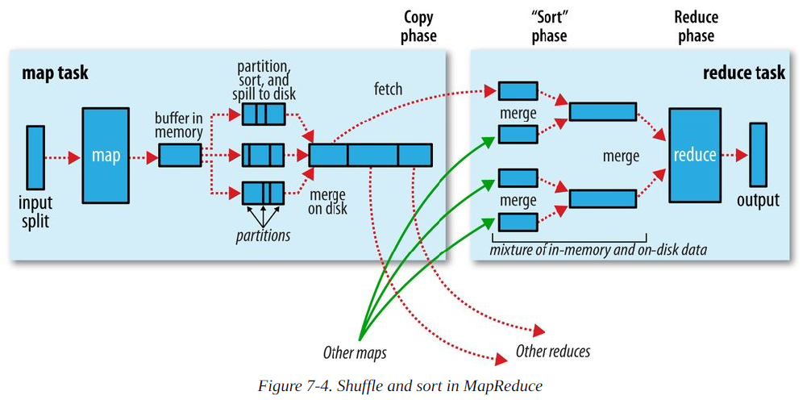

# MapReduce 工作流程

添加 MapReduce 工作流程图

读取文件按照每块128M切分文件

Map 将数据写入缓冲区

缓冲区 大小 100 M ，超过 80% 溢写(分区、排序)到磁盘

通过 hash 进行排序

最终相同分区的进行合并

通过 Shuffle 将相同的分区的内容抓取到同一个 Reduce

在这个过程中对同一个分区的内容进行合并

通过 Reduce Task 进行聚合后输出