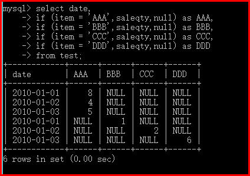

# MySQL 行转列

## 行转列

### 说明

原始数据如下图所示：（商品的销售明细）

date=业务日期；Item=商品名称；saleqty=销售数量


### 建表准备

``` sql
-- 建立测试数据（表）
create table test (Date varchar(10), item char(10),saleqty int);

insert test values('2010-01-01','AAA',8);
insert test values('2010-01-02','AAA',4);
insert test values('2010-01-03','AAA',5);
insert test values('2010-01-01','BBB',1);
insert test values('2010-01-02','CCC',2);
insert test values('2010-01-03','DDD',6);
```

### 实现方法和思路

方法一：case item when x then xx when y then yy end  

``` sql
select date,
case item when 'AAA' then saleqty end as AAA,
case item when 'BBB' then saleqty end as BBB,
case item when 'CCC' then saleqty end as CCC,
case item when 'DDD' then saleqty end as DDD
from test;
```

方法二：if(条件判断，成立结果，不成立结果)

``` sql
select date,
if (item = 'AAA',saleqty,null) as AAA,
if (item = 'BBB',saleqty,null) as BBB,
if (item = 'CCC',saleqty,null) as CCC,
if (item = 'DDD',saleqty,null) as DDD
from test;
```



### 按日期汇总行

``` sql
select date,
sum(case item when 'AAA' then saleqty end)as AAA,
sum(case item when 'BBB' then saleqty end)as BBB,
sum(case item when 'CCC' then saleqty end)as CCC,
sum(case item when 'DDD' then saleqty end)as DDD
from test group by date;

select date,
sum(if (item = 'AAA',saleqty,null)) as AAA,
sum(if (item = 'BBB',saleqty,null)) as BBB,
sum(if (item = 'CCC',saleqty,null)) as CCC,
sum(if (item = 'DDD',saleqty,null)) as DDD
from test group by date;
```


### 处理数据

将空值的栏位填入数字 0

``` sql
select date,
ifnull(sum(case item when 'AAA' then saleqty end) ,0)as AAA,
ifnull(sum(case item when 'BBB' then saleqty end) ,0)as BBB,
ifnull(sum(case item when 'CCC' then saleqty end) ,0)as CCC,
ifnull(sum(case item when 'DDD' then saleqty end) ,0)as DDD
from test group by date;

select date,
ifnull(sum(if (item = 'AAA',saleqty,null)),0) as AAA,
ifnull(sum(if (item = 'BBB',saleqty,null)),0) as BBB,
ifnull(sum(if (item = 'CCC',saleqty,null)),0) as CCC,
ifnull(sum(if (item = 'DDD',saleqty,null)),0) as DDD
from test group by date;
```


### 简便方式

``` sql
select date,
sum(if (item = 'AAA',saleqty,0)) as AAA,
sum(if (item = 'BBB',saleqty,0)) as BBB,
sum(if (item = 'CCC',saleqty,0)) as CCC,
sum(if (item = 'DDD',saleqty,0)) as DDD
from test group by date;
```

