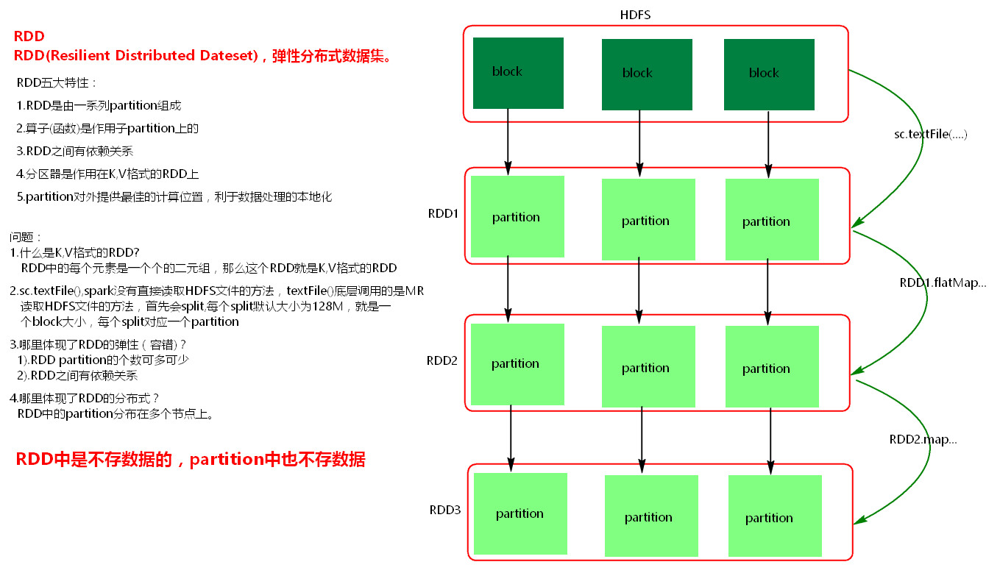

## RDD

### RDD 是什么

&nbsp;&nbsp;&nbsp;&nbsp;RDD(Resilient Distributed Dataset)，弹性分布式数据集

### RDD 五大特性

1.	RDD 是由一系列的 partition 组成的。
2.	函数是作用在每一个 partition（split）上的。
3.	RDD 之间有一系列的依赖关系。
4.	分区器(HashPartitioner)是作用在 K,V 格式的 RDD 上。
5.	RDD 提供一系列最佳的计算位置。

### RDD 分区

&nbsp;&nbsp;&nbsp;&nbsp;[ Spark & Hadoop 的分区 ]

1. Spark 的分区是切片的个数，每个 RDD 都有自己的分区数。
2. Hadoop 的分区指的是 Reduce 的个数，是 Map 过程中对 Key 进行分发的目的地。

&nbsp;&nbsp;&nbsp;&nbsp;[ 指定分区 repartition 和 coalesce ]

1. rdd.repartition() 调用的就是 coalesce，始终进行 shuffle 操作。
2. 如果是减少分区，推荐使用 coalesce,可以指定是否进行 shuffle 操作。
3. 通过 coalesce 增加分区时，必须指定 shuffle 为 true，否则分区数不变。

.png)

.png)