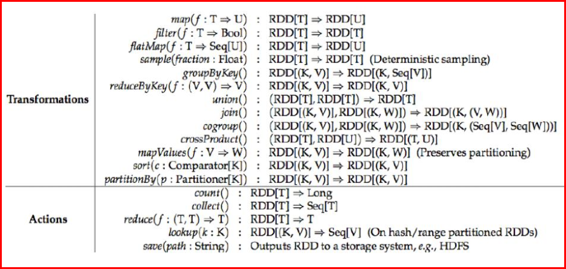

# RDD 算子

## 说明

RDD 有两种算子

1. Transformation（转换）：Transformation属于延迟计算，当一个RDD转换成另一个RDD时并没有立即进行转换，仅仅是记住了数据集的逻辑操作
2. Action（执行）：触发Spark作业的运行，真正触发转换算子的计算

区别在于 Transformation 产生了新的 RDD ，Action 没有

## Transformation

### filter

过滤符合条件的记录数，true保留，false过滤掉。

### map

将一个RDD中的每个数据项，通过map中的函数映射变为一个新的元素。
特点：输入一条，输出一条数据。

### flatMap

先map后flat。与map类似，每个输入项可以映射为0到多个输出项。

### sample

随机抽样算子，根据传进去的小数按比例进行又放回或者无放回的抽样。

### reduceByKey

将相同的Key根据相应的逻辑进行处理。

### sortByKey/sortBy

作用在K,V格式的RDD上，对key进行升序或者降序排序。

## 

### count

返回数据集中的元素数。会在结果计算完成后回收到Driver端。

### take(n)

返回一个包含数据集前n个元素的集合。

### first

first=take(1),返回数据集中的第一个元素。

### foreach

循环遍历数据集中的每个元素，运行相应的逻辑。

### collect

将计算结果回收到Driver端。

代码部分参考 [Spark笔记整理（四）：Spark RDD算子实战](https://blog.51cto.com/xpleaf/2108481)
