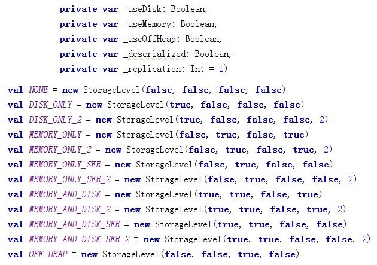

# RDD 持久化

## 说明

控制算子有三种，cache,persist,checkpoint，以上算子都可以将 RDD 持久化，持久化的单位是 partition。

cache 和 persist 都是懒执行的。必须有一个 action 类算子触发执行。

checkpoint 算子不仅能将 RDD 持久化到磁盘，还能切断 RDD 之间的依赖关系。

## cache

默认将 RDD 的数据持久化到内存中。cache 是懒执行。

注意：chche () = persist()=persist(StorageLevel.Memory_Only)

``` bash
 SparkConf conf = new SparkConf();
 conf.setMaster("local").setAppName("CacheTest");
 JavaSparkContext jsc = new JavaSparkContext(conf);
 JavaRDD<String> lines = jsc.textFile("./NASA_access_log_Aug95");

 lines = lines.cache();
 long startTime = System.currentTimeMillis();
 long count = lines.count();
 long endTime = System.currentTimeMillis();
 System.out.println("共"+count+ "条数据，"+"初始化时间+cache时间+计算时间="+ 
          (endTime-startTime));
		
 long countStartTime = System.currentTimeMillis();
 long countrResult = lines.count();
 long countEndTime = System.currentTimeMillis();
 System.out.println("共"+countrResult+ "条数据，"+"计算时间="+ (countEndTime-
           countStartTime));
		
 jsc.stop();
```

## persist

可以指定持久化的级别。最常用的是 MEMORY_ONLY 和 MEMORY_AND_DISK。 ”_2”表示有副本数。

持久化级别如下：



``` bash
rdd.persist(StorageLevel.MEMORY_AND_DISK)
```

### cache 和 persist 的注意事项：

1.	cache 和 persist 都是懒执行，必须有一个 action 类算子触发执行。
2.	cache 和 persist 算子的返回值可以赋值给一个变量，在其他 job 中直接使用这个变量就是使用持久化的数据了。持久化的单位是 partition。
3.	cache 和 persist 算子后不能立即紧跟 action 算子。
错误：rdd.cache().count() 返回的不是持久化的 RDD，而是一个数值了。

## checkpoint

checkpoint 将 RDD 持久化到磁盘，还可以切断 RDD 之间的依赖关系。

### checkpoint 的执行原理：
1.	当 RDD 的 job 执行完毕后，会从 finalRDD 从后往前回溯。
2.	当回溯到某一个 RDD 调用了 checkpoint 方法，会对当前的 RDD 做一个标记。
3.	Spark 框架会自动启动一个新的 job，重新计算这个 RDD 的数据，将数据持久化到 HDFS 上。

优化：对 RDD 执行 checkpoint 之前，最好对这个 RDD 先执行 cache，这样新启动的 job 只需要将内存中的数据拷贝到 HDFS 上就可以，省去了重新计算这一步

``` bash
 SparkConf conf = new SparkConf();
 conf.setMaster("local").setAppName("checkpoint");
 JavaSparkContext sc = new JavaSparkContext(conf);
 sc.setCheckpointDir("./checkpoint");
 JavaRDD<Integer> parallelize = sc.parallelize(Arrays.asList(1,2,3));
 parallelize.checkpoint();
 parallelize.count();
 sc.stop();

```